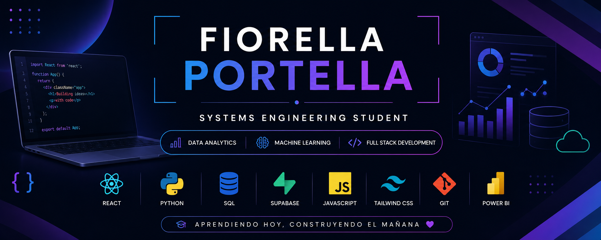
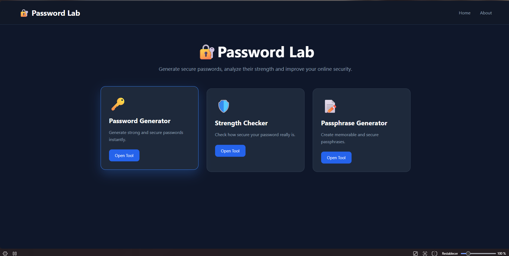

<h1 align="center">¡Hola! 👋 Soy Fiorella Portella</h1>

  

  <b>Systems Engineering Student</b> 
  Passionate about Data Analytics, Machine Learning and Full Stack Development.

  
  
  
  

---

# 👩🏻‍💻 Sobre mí

Soy estudiante de **Ingeniería de Sistemas** en la **Universidad de Lima**.

Me gusta desarrollar proyectos que resuelvan problemas reales mientras continúo aprendiendo nuevas tecnologías. Actualmente me interesa especialmente el desarrollo web, el análisis de datos y el Machine Learning.

Actualmente estoy construyendo proyectos utilizando **React**, **Supabase** y **Python**, además de fortalecer mis conocimientos en **Data Analytics**.

---

# 🚀 Tecnologías

### Frontend

### Backend & Database

### Programming

### Tools

---

# ⭐ Proyectos destacados

## 🎉 Party Planner

Aplicación web desarrollada con React y Supabase para organizar eventos, administrar invitados, mesas y presupuesto desde una única plataforma.

---

## 🔐 Password Lab

Colección de herramientas relacionadas con la generación, análisis y evaluación de contraseñas seguras.

---

# 📫 Contacto

- 💼 LinkedIn: https://www.linkedin.com/in/TU-LINKEDIN
- 📧 Email: contacto.fio.portella@gmail.com
